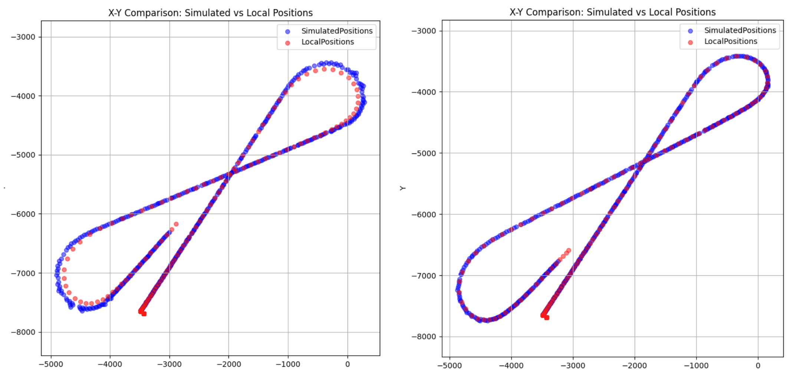

# Network Delay Vehicle Prediction using DNN

### 📋 프로젝트 개요

**레이싱 게임의 드리프트와 같은 비선형 움직임에서 발생하는 네트워크 예측 오차를 DNN으로 해결**

- **개발 기간**: 2024.12.07 ~ 2024.12.23
- **개발 환경**: Unreal Engine 5.3.2, PyTorch
- **팀 구성**: 3인 (AI 모델 개발 2인, 언리얼 엔진 개발 1인)
- **담당 역할**: 언리얼 엔진 내 EasyVehicle, EasyVehicleMovementComponent 개발

---

### 🎯 프로젝트 목표

기존 멀티플레이 게임의 등속 예측(Constant Velocity Prediction) 모델은 직선 움직임에는 효과적이지만, **드리프트와 같은 비선형 움직임에서 큰 오차**를 발생시킵니다.

본 프로젝트는 **DNN 모델을 활용하여 이러한 예측 오차를 개선**하고, 보다 안정적인 멀티플레이 환경을 구축하는 것을 목표로 합니다.

---

### 🛠️ 주요 구현 내용

### 1. Custom Movement Component 개발

기존 `CharacterMovementComponent`의 한계를 극복하기 위해 커스텀 컴포넌트 개발

**EasyVehicleMovementComponent**: 등속 예측과 DNN 예측 모델을 모두 지원하는 커스텀 Movement Component

**핵심 기능**:
- `SmoothClientPosition` 함수 오버라이드
- `SmoothClientPosition_Extrapolate`: 외삽법 또는 DNN 기반 위치 예측
- `SmoothClientPosition_UpdateVisuals_Extrapolate`: 예측 결과 시각화를 위한 메쉬 오프셋 설정

### 2. DNN 모델 설계

**Input Features (6개)**:
- 선형 속도 / 선형 가속도
- 각속도 / 각가속도
- 속도 × Δt / 각속도 × Δt

**Output Features (2개)**:
- 위치 변화량 (ΔPosition)
- 회전 변화량 (ΔRotation)

> 💡 절대 위치가 아닌 **변화량을 예측**하여 현재 상태에서 다음 상태를 계산하는 방식 채택

**학습 환경**: 100ms 고정 네트워크 지연 환경

### 3. NNE 플러그인 통합

- Unreal Engine 5.3의 **NNE(Neural Network Engine)** 플러그인 활용
- 학습된 모델(ONNX)을 언리얼 엔진에 통합하여 **실시간 추론** 구현
- Simulated Proxy의 메시 위치를 실시간으로 업데이트

---

### 📊 성능 비교 결과

| 예측 모델 | 드리프트 구간 정확도 | 특징 |
|:---------|:------------------:|:-----|
| **등속 예측** |  낮음 | 비선형 움직임(드리프트 구간)에서 큰 오차 발생 |
| **DNN 예측** |  높음 | 실제 경로를 근접하게 따라가며 오차 크게 감소 |

### 시각화 비교

- **좌측 (등속 예측)**: 예측 경로(파란색)가 실제 경로(주황색)에서 크게 벗어남
- **우측 (DNN 예측)**: 예측 경로가 실제 경로를 매우 근접하게 추적

---

### 🚀 향후 발전 방향

1. **3D 환경 확장**: Z축 이동, 경사면 등 복잡한 3차원 움직임 지원
2. **동적 지연시간 대응**: 고정 지연(100ms)이 아닌 가변 네트워크 환경 학습
3. **차량 다양성**: 서로 다른 속도와 특성을 가진 차량에 대한 일반화
4. **충돌 예측**: 드리프트 중 발생하는 충돌 상황 처리
